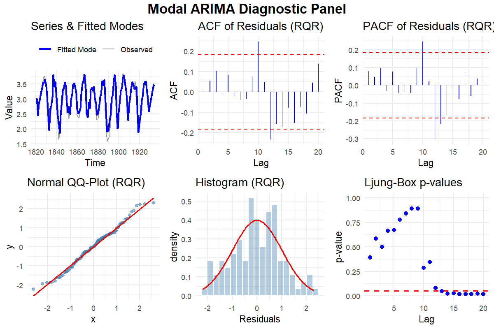
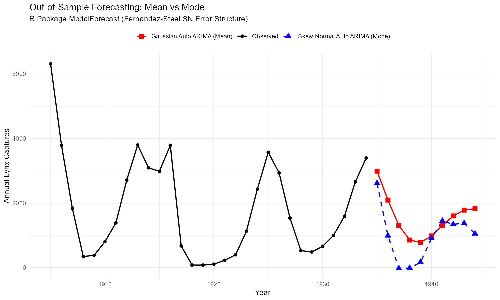

# ModalForecast

<!-- badges: start -->
<!-- badges: end -->

The `ModalForecast` package implements parametric modal ARIMA models utilizing the Skew Normal (Two-Piece Normal) distribution. Instead of connecting the expected value (mean) to covariates, the model connects the **conditional mode** to the systematic autoregressive integrated moving average (ARIMA) components. 

By modeling the mode directly, this framework helps mitigate the effects of localized extremes, asymmetry, and non-normal behavior, providing robust centralized predictions under asymmetric error distributions.

## Methodology

### The Skew Normal (Two-Piece Normal) Distribution
To construct a modal regression model, we require a flexible parametric continuous distribution where the mode is explicitly parameterized and differentiable. We adopt the Fernandez-Steel formulation of the asymmetric (skew) normal distribution.

Let $y_t \in \mathbb{R}$ be the response variable at time $t$. We assume $y_t$ follows a skew-normal distribution with mode $\mu_t$, scale $\sigma$, and skewness parameter $\gamma$:

$$y_t \sim \text{SN}(\mu_t, \sigma, \gamma)$$

The probability density function is given by:

$$ f(y_t | \mu_t, \sigma, \gamma) = \frac{2}{\sigma(\gamma + 1/\gamma)} \begin{cases} \phi\left(\frac{y_t - \mu_t}{\sigma \gamma}\right) & \text{if } y_t \ge \mu_t \\ \phi\left( \frac{y_t - \mu_t}{\sigma / \gamma} \right) & \text{if } y_t < \mu_t \end{cases} $$

where $\phi(\cdot)$ is the probability density function of the standard normal distribution. A crucial property of this parameterization is that the density reaches its maximum exactly at $y_t = \mu_t$. Consequently, $\mu_t$ represents the conditional mode of the distribution.

### Systematic Component: Modal ARIMA

Instead of the standard mean-based ARIMA, we model the sequence of conditional modes $\mu_t$:

$$ \mu_t = c + \sum_{i=1}^p \phi_i y_{t-i} + \sum_{j=1}^q \theta_j \epsilon_{t-j} $$

where $\epsilon_t = y_t - \mu_t$ is the asymmetric prediction error, $p$ is the autoregressive order, and $q$ is the moving average order. The parameters are estimated via Maximum Likelihood Estimation (MLE) over the sequence of observations.

## Installation

You can install the development version of ModalForecast from GitHub with:

```r
# install.packages("devtools")
devtools::install_github("chedgala/ModalForecast")
```

## Example Application: Lynx Dataset

The following plots demonstrate the diagnostic capabilities and forecasting performance of the `ModalForecast` package using the well-known `lynx` dataset.

### Package Diagnostics
The `diagnostics()` function provides a comprehensive panel including fitted modes, ACF/PACF of Randomized Quantile Residuals (RQR), and normality checks.



### Out-of-Sample Forecasting
Comparison between traditional Gaussian ARIMA (Mean) and the Skew-Normal Modal ARIMA (Mode).



## Quick Start Tutorial

Below is a brief tutorial showing how to adjust a modal ARIMA model to empirical data.

```r
library(ModalForecast)

# Use the famous lynx dataset (annual numbers of lynx trappings, 1821–1934 in Canada)
data(lynx)
y <- log10(lynx) # log-transformation is common for this dataset

# Fit a Modal ARIMA(2,0,0) model manually:
fit_manual <- fit_modal_arima(y, order=c(2, 0, 0))

# Or, use the rigorous Auto Modal ARIMA selector (searches grid p, q recursively):
# This will minimize AIC and automatically estimate d if needed.
fit_auto <- auto.modal.arima(y, d=0, max.p=5, max.q=5)

# Print the automatically fitted modal model
print(fit_auto)

# Model Summary & Diagnostics
summary(fit_auto)
diagnostics(fit_auto)

# Forecast modal trajectory
pred <- forecast(fit_auto, h=10)
plot(pred)
```

The fitted object returns standard coefficients, scale `sigma`, and skewness `gamma`. If `gamma` is significantly different from 1, it indicates positive asymmetry (right-skewness if $>1$) or negative asymmetry ($<1$), capturing patterns that typical least-squares ARIMA would miss.
